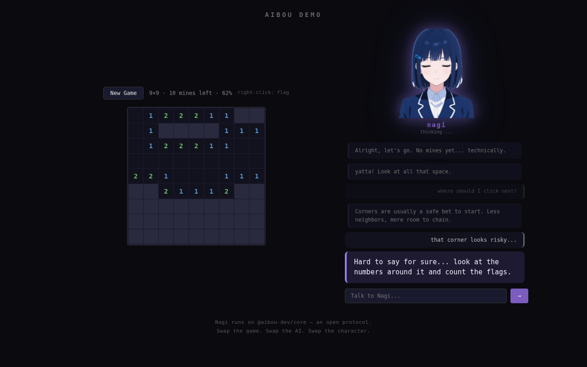

## 作ったもの

ゲームにAIコンパニオンを接続するためのオープンプロトコル **aibou** を作りました。



デモは [aibou.dev](https://aibou.dev) で触れます。マインスイーパーを遊びながら、コンパニオンの「凪（Nagi）」が横で一緒に考えてくれます。

ソースは [GitHub](https://github.com/aibou-dev/aibou) で公開しています。

## コンセプト: 正解を教えないAI

ゲームにAIを載せるとき、ありがちなのは「ヒントシステム」としての実装です。AIは答えを知っていて、タイミングよく教えてくれる。便利だけど、それは「相棒」ではありません。

aibouが目指しているのは、プレイヤーと同じ情報だけを見て、一緒に考えるコンパニオンです。盤面が曖昧で論理的に解けない局面では「ここは私にもわからない」と正直に言う。その不確実性を一緒に楽しむ設計にしています。

デモに登場する「凪」はそのコンセプトを体現するキャラクターです。穏やかで、観察力があって、わからないときは素直にそう言う。興奮したときだけ「yatta!」と日本語が混ざります。

## 設計の核心: boardSummaryという契約

aibouのプロトコルは、ゲームの状態をAIに伝える方法として **自然言語テキスト** を採用しています。型定義やJSONスキーマではなく、「隣で見ている友人に口頭で説明するような文章」がインターフェースの中心です。

これが `boardSummary` フィールドで、プラグインの `summarizeState` メソッドが生成します。マインスイーパープラグインの実装はこうなっています。

```typescript
// packages/plugin-minesweeper/src/plugin.ts

function summarizeState(state: MinesweeperState): string {
  const totalCells = state.rows * state.cols
  const safeCells = totalCells - state.totalMines
  const percentage = safeCells > 0
    ? Math.round((state.revealedCount / safeCells) * 100)
    : 0

  const parts: string[] = [
    `${state.rows}x${state.cols} board, ${state.totalMines} mines.`,
    `${state.revealedCount} of ${safeCells} safe cells revealed (${percentage}%).`,
  ]

  if (state.flaggedCount > 0) {
    parts.push(`${state.flaggedCount} flags placed.`)
  }

  if (state.lastAction) {
    const { type, row, col, chainSize } = state.lastAction
    if (type === "reveal") {
      if (chainSize && chainSize > 1) {
        parts.push(
          `Last move: opened (${row},${col}), triggered a chain reveal of ${chainSize} cells!`
        )
      } else {
        const cell = state.board[row]?.[col]
        if (cell?.mine) {
          parts.push(`Last move: opened (${row},${col}) — hit a mine.`)
        } else if (cell) {
          parts.push(
            `Last move: opened (${row},${col}), revealed a ${cell.adjacentMines}.`
          )
        }
      }
    }
  }

  return parts.join(" ")
}
```

出力は `"9x9 board, 10 mines. 34 of 71 safe cells revealed (48%). Last move: opened (3,7), revealed a 2."` のような文字列です。この文字列をAIが読んで、状況を把握し、反応を返します。

自然言語にした理由は2つあります。1つは、LLMにとって構造化データより自然言語のほうが文脈理解の精度が高いこと。もう1つは、ゲーム開発者にとって「友人に説明する文章を書く」ほうが「スキーマに合わせてデータを整形する」より直感的だからです。

## プラグイン・アダプター・ペルソナの分離

aibouは3つの独立した層で構成されています。

| 層 | 役割 | 例 |
|---|---|---|
| **ゲームプラグイン** | ゲーム状態を`boardSummary`に変換 | マインスイーパー、ソリティア |
| **コンパニオンアダプター** | LLMに接続して応答を生成 | Claude、GPT-4o、Ollama |
| **ペルソナ** | キャラクターの性格・口調を定義 | 凪、または自作キャラ |

それぞれ独立して差し替えられます。好きなゲームに、好きなAIで、好きなキャラクターを乗せられる。これがaibouの価値提案です。

コンパニオンの応答には `emotion` フィールドがあり、これがアバターエンジン `@aibou-dev/bunshin` に接続されています。

```typescript
// packages/core/src/types.ts

interface CompanionResponse {
  message: string
  emotion?: "neutral" | "curious" | "excited" | "worried" | "happy" | "thinking"
}
```

`emotion` の値に応じて、PNGTuber形式のアバターが表情を切り替えます。発話中は口パクアニメーションも動きます。プロトコル側は `emotion` を返すだけで、描画はbunshinが担当するという分離です。

## 技術スタック

- **monorepo**: npm workspaces（6パッケージ）
- **言語**: TypeScript strict mode、ES Modules
- **デモ**: Vite + vanilla TS（フレームワークなし）
- **テスト**: Playwright e2e（8テスト）
- **CI**: GitHub Actions（typecheck + build + test）
- **公開済みパッケージ**: `@aibou-dev/core`, `@aibou-dev/bunshin`, `@aibou-dev/adapter-claude`, `@aibou-dev/plugin-minesweeper`

プロトコルの仕様は [`@aibou-dev/core` の型定義](https://github.com/aibou-dev/aibou/blob/main/packages/core/src/types.ts)がそのまま正とする形にしています。型を読めば仕様がわかる設計です。

## 今後やりたいこと

- **plugin-solitaire**: 次の公式ゲームプラグイン
- **bunshin VRM対応**: PNGTuberに加えて3Dモデルのアバターもサポート
- **awesome-aibouリスト**: コミュニティ製のプラグインやペルソナを集約

ゲームプラグインは `AibouPlugin` インターフェースを実装すれば誰でも作れます。新しいゲームを対応させたい方、AIアダプターを追加したい方、あるいはプロトコル設計へのフィードバックがある方は、GitHubのissueかPRでお待ちしています。

## リンク

- デモ: [aibou.dev](https://aibou.dev)
- GitHub: [github.com/aibou-dev/aibou](https://github.com/aibou-dev/aibou)
- npm: `npm install @aibou-dev/core`
- プロトコル型定義: [packages/core/src/types.ts](https://github.com/aibou-dev/aibou/blob/main/packages/core/src/types.ts)
- ペルソナの定義方法: [README.md](https://github.com/aibou-dev/aibou#defining-your-own-companion)
